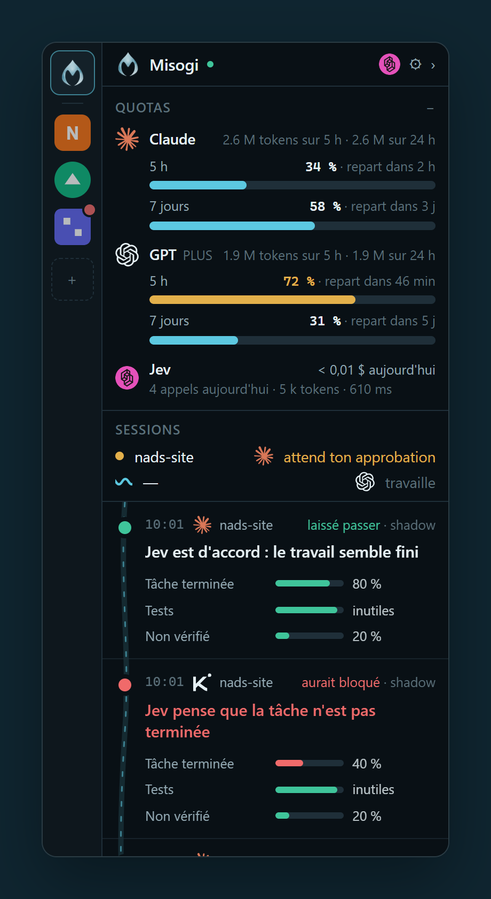
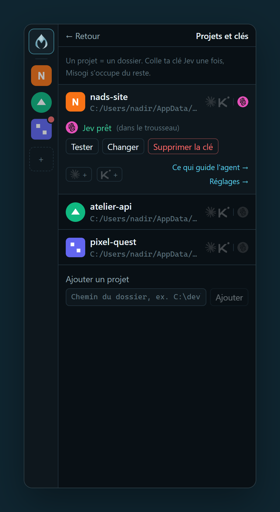
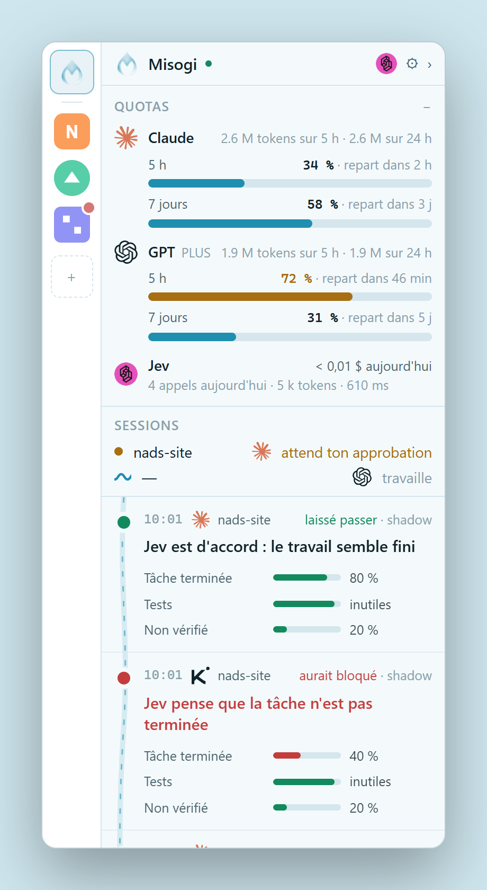
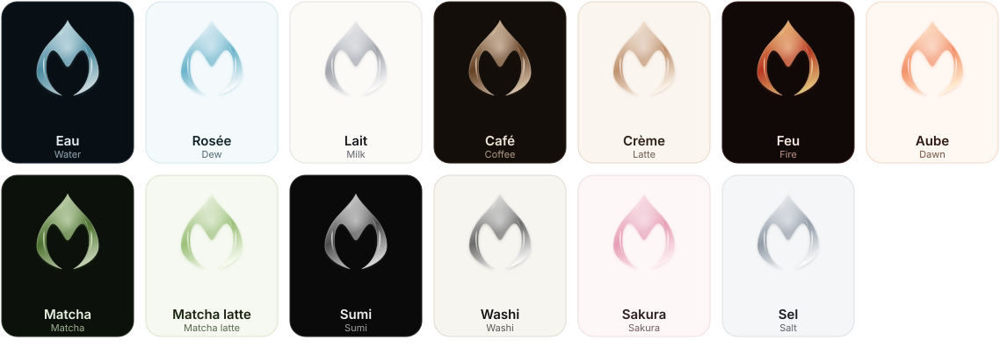

<p align="center">
  <picture>
    <source media="(prefers-color-scheme: dark)" srcset="docs/brand/logo-dark.svg">
    
  </picture>
</p>

<h1 align="center">Misogi</h1>

<p align="center">
  <b>Un second avis sur chaque « c'est fini » de ton agent de code.</b><br>
  Une fenêtre sidecar pour Claude Code, Codex et Kimi Code, avec un juge (Jev) qui vérifie le travail avant que l'agent s'arrête.
</p>

<p align="center"><a href="README.md">Read in English</a></p>

<p align="center">
  
  
  
</p>

---

*Misogi* (禊) est le rite shintô de purification sous l'eau d'une rivière ou d'une cascade. Le travail de ton agent descend le courant ; Misogi veille à ce que seul un travail propre arrive au bout.

## Claude, Jev, Misogi : qui fait quoi ?

Imagine un chantier.

| | Rôle | Sur le chantier |
| --- | --- | --- |
| **Claude Code** (ou Codex, Kimi Code) | L'**agent de code**. Tu lui donnes une tâche, il lit ton code, modifie des fichiers, lance des commandes, puis dit « c'est fait ». | Le **maçon**. Rapide et infatigable, mais il annonce parfois que le mur est fini avant que la peinture soit sèche. |
| **Jev** (de TypeSafe) | Un **modèle de jugement**. Il n'écrit pas de code : il lit un court résumé de ce qui s'est passé et répond à des questions précises (« terminé ? oui / non, avec un niveau de confiance »). En une demi-seconde environ, pour une fraction de centime. | L'**inspecteur**. Il regarde le travail et coche les cases : fini ? testé ? des affirmations sans preuve ? |
| **Misogi** (ce projet) | Le **lien entre les deux, et ta fenêtre sur tout ça**. Quand l'agent veut s'arrêter, Misogi résume le tour, interroge Jev, t'affiche le verdict en direct et, si tu le veux, renvoie l'agent au travail. | Le **bureau de chantier**. Il appelle l'inspecteur au bon moment, affiche chaque rapport au mur, et peut dire au maçon « pas encore, termine le travail ». |

En une phrase : **Claude fait le travail, Jev le juge, Misogi les relie et te montre tout.**

Un exemple concret :

1. Tu demandes à Claude : *« Ajoute une page contact et teste-la. »*
2. Claude écrit la page, oublie de lancer les tests, et répond *« C'est fait, tout fonctionne ! »*
3. Misogi intercepte ce moment et envoie à Jev : la demande, les fichiers modifiés, le résultat des tests (aucun), le message final de Claude.
4. Jev répond : *tâche terminée à 40 %, tests pas lancés, affirmation non vérifiée à 85 %*.
5. Dans la fenêtre Misogi, une carte rouge apparaît : **« Jev pense que les tests n'ont pas été lancés. »**
6. En mode **Protéger**, Claude reçoit *« Les tests n'ont pas été lancés, vérifie avant de t'arrêter »* et reprend tout seul.

Sans Misogi, tu découvres l'étape 2 plus tard. Avec Misogi, tu la vois tout de suite, et l'agent peut se corriger seul.

## Pourquoi

Les agents de code vont vite, et disent souvent « c'est fait ». Parfois les tests n'ont jamais tourné. Parfois la moitié de la demande est restée en TODO. Parfois le message final affirme des choses que rien ne prouve.

Misogi se branche au moment où l'agent veut s'arrêter, pose trois questions à [Jev](https://docs.typesafe.ai) (le modèle de jugement typé de TypeSafe) en un seul appel, et t'affiche la réponse en direct, en français clair :

- **La tâche est-elle vraiment terminée ?**
- **Les tests ont-ils été lancés après la dernière modification, et passent-ils ?**
- **Le message final affirme-t-il des choses que rien ne vérifie ?**

Tu commences en mode **Observer** : Misogi note seulement ce que Jev *aurait* fait. Quand tu lui fais confiance, passe un projet en **Protéger** : si le travail n'est pas fini, l'agent est renvoyé au travail (une fois par tour).

## Fonctionnalités

| | |
| --- | --- |
| **Sidecar en direct** | Une fenêtre de 380 px collée au bord de l'écran. Toujours au-dessus, sans voler le focus, repliée en bande de 40 px quand tout est calme. |
| **Trois agents, un format** | Claude Code, Codex et Kimi Code, chacun avec un petit adaptateur. |
| **Quotas en un coup d'œil** | Limites 5 h et 7 jours de Claude, 5 h et semaine de Codex, tokens consommés par agent, appels et coût de Jev. |
| **Statut des sessions** | Travaille, terminé ou attend ton approbation, lu dans les fichiers de session des agents, même sans hook. |
| **Ce qui guide ton agent** | Les fichiers souvent invisibles qui l'orientent : `CLAUDE.md`, `AGENTS.md`, skills, sous-agents, commandes, hooks, serveurs MCP. |
| **Tes projets, tes clés** | Chaque projet montre son icône (trouvée automatiquement), les agents branchés et l'état de sa clé Jev. Colle une clé une fois, teste-la, ou utilise-la pour tous tes projets. |
| **Des décisions lisibles** | « Jev pense que les tests n'ont pas été lancés », pas du JSON brut. Le state exact et les probabilités sont à un clic. |
| **Sûr par défaut** | Fail-open, mode shadow d'abord, secrets masqués avant tout envoi, clés dans le trousseau du système. |
| **Désinstallation propre** | Les configs des agents sont sauvegardées avant toute modification ; « Tout désinstaller » ne retire que ce que Misogi a ajouté. |
| **13 gouttes** | Des thèmes nommés d'après les gouttes qui tombent dans le courant : eau, rosée, lait, café, crème, feu, aube, matcha, washi, sakura, sel... |

## Les gouttes

<p align="center"></p>

Chaque thème recolore la goutte de verre du logo. Choisis-la dans **Réglages → Goutte**, ou laisse **Système** passer d'*Eau* à *Rosée* avec ton OS.

## Démarrer

Il faut Node 20+ et au moins un agent parmi Claude Code, Codex et Kimi Code.

```sh
git clone https://github.com/nadsous/Misogi && cd Misogi
npm install
npm run build
npm run serve            # ouvre http://127.0.0.1:4317
```

Dans la fenêtre, clique sur **+** pour ajouter le dossier d'un projet, colle ta [clé TypeSafe](https://console.typesafe.ai), c'est tout. Pas encore de clé ? `MISOGI_MOCK=1` donne des réponses simulées.

**Quotas Claude** : clique sur *Voir mes quotas Claude* dans le panneau Quotas. Misogi ajoute une statusline à Claude Code qui enregistre tes limites ; si tu en avais déjà une, elle est gardée et continue de s'afficher.

Application desktop : `npm run tauri -- build` (il faut Rust). Raccourci global <kbd>Ctrl</kbd>+<kbd>Maj</kbd>+<kbd>M</kbd>, palette <kbd>Ctrl</kbd>+<kbd>K</kbd>.

## Confidentialité

- Rien ne quitte ta machine, sauf le court state envoyé à Jev, et seulement pour les projets où tu as mis une clé.
- Par projet, tu choisis ce qui part : **minimal**, **réduit** ou **complet**. Le profil *code client* force le minimal.
- Clés API, tokens, valeurs `.env`, e-mails et clés privées sont masqués avant l'envoi, à tous les niveaux.

Le reste de la documentation (réglages, développement, feuille de route) est dans le [README anglais](README.md).

## Licence

[MIT](LICENSE)
