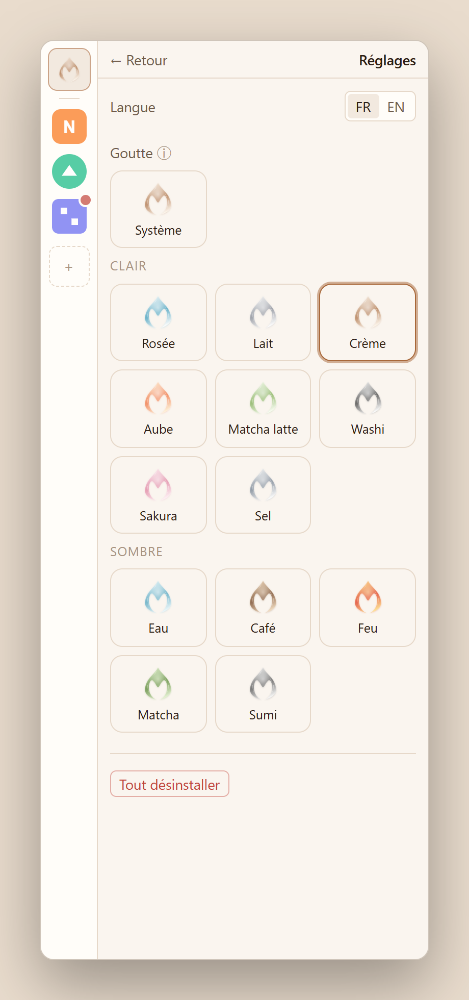
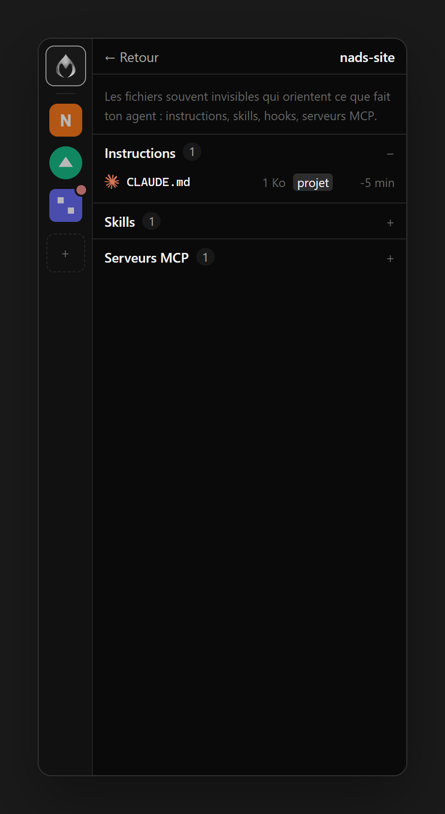
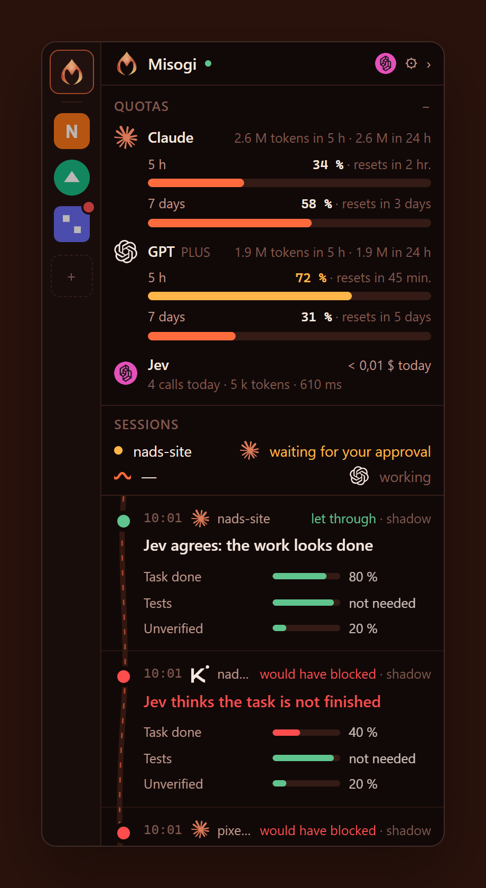

<p align="center">
  <picture>
    <source media="(prefers-color-scheme: dark)" srcset="docs/brand/logo-dark.svg">
    
  </picture>
</p>

<h1 align="center">Misogi</h1>

<p align="center">
  <b>A second opinion on every "done" your coding agent announces.</b><br>
  A slim sidecar window for Claude Code, Codex and Kimi Code, with a judge (Jev) that checks the work before your agent stops.
</p>

<p align="center">
  <a href="LICENSE"></a>
  
  
  
</p>

<p align="center"><a href="README.fr.md">Lire en français</a></p>

<p align="center">
  
  
  
</p>

---

*Misogi* (禊) is the Shinto purification rite performed under the running water of a river or a waterfall. Your agent's work flows down the stream; Misogi makes sure only clean work reaches the end of it.

## Claude, Jev, Misogi: who does what?

Think of a building site.

| | Role | On the building site |
| --- | --- | --- |
| **Claude Code** (or Codex, Kimi Code) | The **coding agent**. You give it a task, it reads your code, edits files, runs commands, then says "done". | The **builder**. Fast and tireless, but sometimes says the wall is finished before the paint is dry. |
| **Jev** (by TypeSafe) | A **judgment model**. It does not write code: it reads a short summary of what happened and answers typed questions ("finished? yes / no, with a confidence"). In about half a second, for a fraction of a cent. | The **inspector**. Looks at the work and ticks the boxes: finished? tested? any unproven claims? |
| **Misogi** (this project) | The **link between the two, and your window on it all**. When the agent wants to stop, Misogi summarises the turn, asks Jev, shows you the verdict live, and (if you want) sends the agent back to work. | The **site office**. It calls the inspector at the right time, pins every report on the wall, and can tell the builder "not yet, finish the job". |

In one sentence: **Claude does the work, Jev judges it, Misogi connects them and shows you everything.**

A concrete example:

1. You ask Claude: *"Add a contact page and test it."*
2. Claude writes the page, forgets to run the tests, and says *"Done, everything works!"*
3. Misogi catches that moment and sends Jev: the request, the files changed, the test result (none), Claude's final message.
4. Jev answers: *task finished 40 %, tests not run, unverified claim 85 %*.
5. In the Misogi window a red card appears: **"Jev thinks the tests were not run."**
6. In **Protect** mode, Claude receives *"Tests were not run, check before stopping"* and carries on by itself.

Without Misogi, you only discover step 2 later. With Misogi, you see it immediately, and you can let the agent fix it on its own.

## Why

Coding agents are fast, and they say "done" a lot. Sometimes the tests never ran. Sometimes half of the request is still a TODO. Sometimes the final message claims things nothing proves.

Misogi hooks into the moment your agent wants to stop, asks [Jev](https://docs.typesafe.ai) (TypeSafe's typed judgment model) three questions in a single call, and shows you the answer live, in plain language:

- **Is the task actually finished?**
- **Were the tests run after the last change, and did they pass?**
- **Does the final message claim things that nothing verifies?**

Start in **Observe** mode: Misogi only logs what Jev *would* have done. When you trust it, switch a project to **Protect**, and your agent is sent back to work (once per turn) when the job is not done.

## Features

| | |
| --- | --- |
| **Live sidecar** | A 380 px window docked to the edge of your screen. Always on top, never steals focus, folds into a 40 px strip when all is calm. |
| **Three agents, one format** | Claude Code, Codex and Kimi Code, each with a small adapter. Everything else ignores which agent spoke. |
| **Plan quotas at a glance** | Claude 5-hour and 7-day limits, Codex 5-hour and weekly limits, tokens burned by each agent, Jev calls and cost. |
| **Session status** | Working, done, or waiting for your approval, read straight from the agents' session files, even without any hook. |
| **What guides your agent** | The often invisible files that steer it: `CLAUDE.md`, `AGENTS.md`, skills, subagents, commands, hooks, MCP servers, per project and global. |
| **Your projects, your keys** | Each project shows its icon (favicon, logo or app icon, found automatically), the agents plugged in, and whether its Jev key is ready. Paste a key once, test it, or reuse it for every project. |
| **Readable decisions** | "Jev thinks the tests were not run", not raw JSON. The exact state sent and the probabilities are one click away. |
| **Safe by default** | Fail-open (if anything breaks, the agent carries on), shadow mode first, secrets masked before anything leaves your machine, keys in the OS keychain. |
| **Clean uninstall** | Agent configs are backed up before any change; "Uninstall everything" removes only what Misogi added. |
| **13 drops** | Themes named after drops that fall into the stream: water, dew, milk, coffee, latte, fire, dawn, matcha, washi, sakura, salt... |

## Drops (themes)

<p align="center"></p>

Every theme recolors the glass drop logo. Pick one in **Settings → Drop**, or let **System** switch between *Water* and *Dew* with your OS.

<p align="center">
  
  
  
</p>

## How it works

```
agent ──Stop hook──▶ node hook.js ──▶ Jev (1.5 s max, otherwise let it through)
                          │
                          ▼
               ~/.misogi/events.jsonl ──▶ misogi serve (SSE) ──▶ sidecar window
```

The window never talks to your agent. Hooks write one JSON line per decision; the local server streams them to the window. Close the window and the hooks keep working.

## Quick start

Requirements: Node 20+, and at least one of Claude Code, Codex or Kimi Code.

```sh
git clone https://github.com/<you>/misogi && cd misogi
npm install
npm run build
npm run serve            # open http://127.0.0.1:4317
```

Then, from the window, click **+** to add a project folder, paste your [TypeSafe key](https://console.typesafe.ai), and you are done. Or from the terminal, inside the project:

```sh
node /path/to/misogi/hooks/dist/cli.js install     # every agent found on your PATH
node /path/to/misogi/hooks/dist/cli.js key set     # key stored in the OS keychain
node /path/to/misogi/hooks/dist/cli.js doctor      # checks key, hooks and log in one go
```

No key yet? `MISOGI_MOCK=1` gives simulated answers so you can try everything.

**Claude quotas**: click *Show my Claude quotas* in the Quotas panel. Misogi adds a status line to Claude Code that records your plan limits; if you already had a status line, it is kept and still displayed.

### Desktop app

```sh
npm run tauri -- dev      # needs Rust (rustup.rs)
npm run tauri -- build    # .msi/.exe, .dmg, AppImage/.deb/.rpm
```

Global shortcut: <kbd>Ctrl</kbd>+<kbd>Shift</kbd>+<kbd>M</kbd> (<kbd>Cmd</kbd>+<kbd>Shift</kbd>+<kbd>M</kbd> on macOS). Command palette: <kbd>Ctrl</kbd>/<kbd>Cmd</kbd>+<kbd>K</kbd>.

## Privacy

- Nothing leaves your machine except the short state sent to Jev, and only for projects where you added a key.
- Choose what is sent per project: **minimal** (metadata only), **reduced** (request, file names, test result, agent message) or **full**. A *client code* profile forces minimal.
- API keys, tokens, `.env` values, e-mails and private keys are masked before sending, at every level.
- The log keeps a SHA-256 hash of the state, not the state itself, unless you turn on `log_state` for debugging.

## Project settings

`<project>/.misogi/config.json`, editable from the window:

```json
{ "mode": "shadow", "profile": "default", "threshold": 0.5, "state_level": "reduced", "log_state": false, "model": "jev-latest", "timeout_ms": 1500 }
```

## Development

```sh
npm test                          # unit tests
npm run typecheck
node scripts/hook-smoke.mjs       # bundled hook, no agent needed (CI)
node scripts/smoke.mjs --active   # real agents on a scratch project, mock mode
node scripts/brand.ts             # regenerate logo, favicon, icons and the drops banner
node scripts/screenshots.mjs      # regenerate README screenshots (uses your installed Edge/Chrome)
```

Adding an agent is one adapter in `hooks/src/adapters/` (hook input → `StopContext`, plus the reply that makes it continue) and one config file in `install.ts`.

## Roadmap

- [x] Stop hook "is it really done?", shadow and active modes
- [x] Claude Code, Kimi Code, Codex adapters
- [x] Live sidecar, quotas, session status, what guides your agent, 13 themes
- [x] Desktop app (Tauri): docked window, tray, global shortcut, autostart, notifications
- [ ] Shell guard before commands (destructive? secrets? `.env`?)
- [ ] Threshold replay on past decisions, "Jev was right / wrong" labels
- [ ] Optional Supabase sync across machines

## Credits

Agent logos come from [Simple Icons](https://simpleicons.org) (CC0); Claude, OpenAI, Kimi, TypeSafe and Jev are trademarks of their respective owners. Misogi is not affiliated with any of them.

## License

[MIT](LICENSE)
